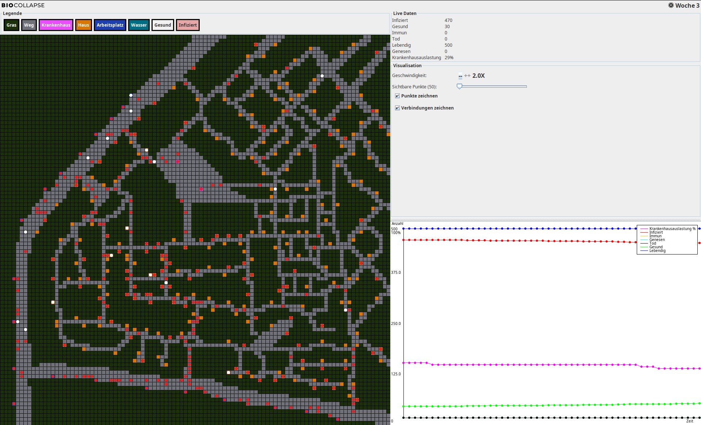
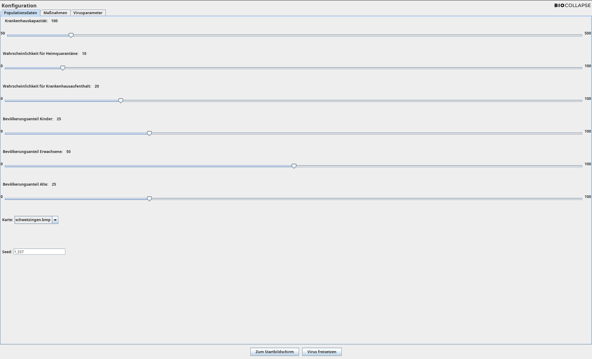
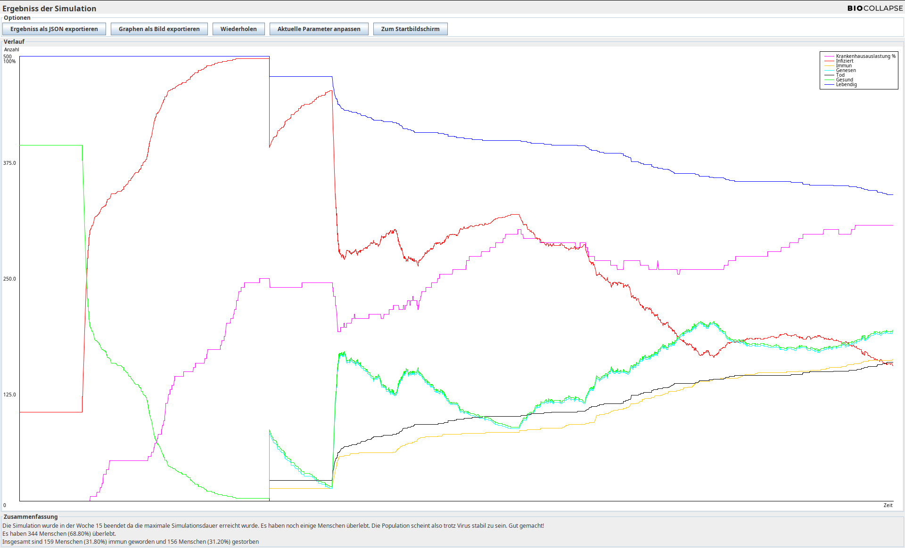

# Virus Spread Simulation Tool

A **simulation tool** that models the spread of a virus, allowing users to test and analyze the effectiveness of various countermeasures. The tool provides customizable settings, real-time statistics, and visual representations of the simulation.

---

## Features
- **Dynamic Virus Spread Simulation**: Visualize how a virus propagates across a population.
- **Customizable Settings**: Adjust parameters like the infection radius, the mortality rate, and countermeasures.
- **Detailed Analytics**: View real-time statistics, graphs, and insights.

---

## Installation

### Prerequisites
- **Java**: Version 21 or newer is recommended. The tool has been tested extensively with Java 21, but versions 13 and above should also work.

---

## Building the Application

### **Option 1: Using Make**

1. Ensure you have `make` installed on your system.
2. Run the following command in the terminal to build and start the application:
   ```bash
   make
   ```

### **Option 2: Manual Setup**7

1. **Compile the Application**:  
   Run the following command in the terminal:  
   ```bash
   javac src/com/biocollapse/main/Main.java
   ```
   > **Note for Windows Users**: Replace `/` with `\` in paths.

2. **Run the Application**:  
   After compilation, execute:  
   ```bash
   java src/com/biocollapse/main/Main
   ```

---

## Application Previews

### **Simulation**
Visualize the real-time spread of the virus.  


### **Settings**
Customize simulation parameters for precise testing.  


### **Statistics**
Analyze detailed data and graphs generated during the simulation.  


---

## Contribution

We welcome contributions! If you have suggestions or find a bug, feel free to open an issue or submit a pull request.

---

## License

This project is licensed under [MIT License](LICENSE).
